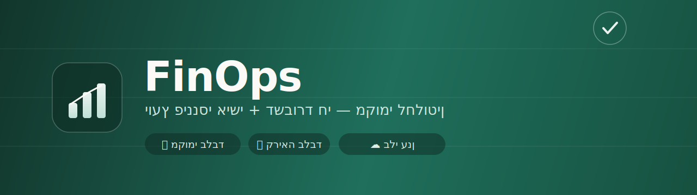

<div align="center">



<br>

[](LICENSE)


### מושך את התנועות מכל חשבונות הבנק וכרטיסי האשראי שלך, מסדר אותן לפי קטגוריות, ומראה תמונה אחת ברורה — לאן הכסף הולך, מה התייקר, ואיפה אפשר לחסוך.

**🔒 הכול רץ על המחשב שלך · ☁️ שום נתון לא עולה לענן · 👁️ קריאה בלבד — לעולם לא מזיז כסף**

</div>

---

## ✨ מה זה עושה

<table>
<tr>
<td width="50%" valign="top">

**📥 משיכה אוטומטית**
מתחבר לאתרי הבנקים וכרטיסי האשראי (כמו שאתה נכנס בעצמך) וקורא את התנועות.

</td>
<td width="50%" valign="top">

**🏷️ סיווג חכם**
מנרמל שמות בתי עסק בעברית ומשייך כל תנועה לקטגוריה.

</td>
</tr>
<tr>
<td width="50%" valign="top">

**📊 דשבורד חי**
תזרים חודשי, קטגוריות, חריגות, תחזית סוף חודש, ומעקב אחר חיובים חוזרים.

</td>
<td width="50%" valign="top">

**🧠 יועץ**
התראות דטרמיניסטיות + המלצות מבוססות-נתונים (אופציונלי, דורש מפתח Anthropic).

</td>
</tr>
</table>

> 💡 כל מספר בדשבורד מגיע מחישוב דטרמיניסטי על הנתונים שלך — לא מ"ניחוש" של מודל שפה.

---

## 🚀 התקנה

> **דרישה:** מחשב **Mac**. את כל השאר הסקריפט מתקין בשבילך.

### הדרך הקלה — פקודה אחת

פותחים את **Terminal** (⌘+רווח, כותבים `terminal`, Enter), מדביקים את השורה הזו ולוחצים Enter:

```bash
curl -fsSL https://raw.githubusercontent.com/booya1986/finops/main/install.sh | bash
```

הסקריפט עושה הכל: בודק ומתקין את מה שצריך (Node), מוריד את הפרויקט,
ופותח **דף הגדרה מעוצב בדפדפן** שמסביר את הכול בסליידים ונותן לך לבחור
בנקים/כרטיסים ולהזין פרטים בצורה מאובטחת. פשוט עוקבים אחרי ההוראות על המסך.

לפתיחת הדשבורד בכל פעם אחר כך:

```bash
cd ~/finops && npm run dashboard
```

<details>
<summary><b>התקנה ידנית (Mac)</b> — למי שכבר יש Node ו-git</summary>

```bash
git clone https://github.com/booya1986/finops.git
cd finops
npm run setup                # התקנה + הגדרה בדפדפן
npm run ingest -- --show     # משיכה ראשונה מהבנק
npm run dashboard            # דשבורד על http://127.0.0.1:3737
```

דורש [Node.js](https://nodejs.org) ‏22.12+.
</details>

<details>
<summary><b>Windows</b> — עובד, אבל בהתקנה ידנית</summary>

סקריפט ההתקנה האוטומטי הוא ל-Mac, אבל הכלי עצמו רץ גם על Windows (הסודות
נשמרים ב-Windows Credential Manager). ההתקנה ידנית:

1. התקן [Node.js](https://nodejs.org) ‏22.12+ ו-[Git](https://git-scm.com/download/win).
2. פתח **PowerShell** והרץ:

```powershell
git clone https://github.com/booya1986/finops.git
cd finops
npm run setup                # התקנה + הגדרה (דף ההגדרה ייפתח בדפדפן)
npm run ingest -- --show     # משיכה ראשונה מהבנק
npm run dashboard            # דשבורד על http://127.0.0.1:3737
```

אם דף ההגדרה לא נפתח לבד — פשוט העתק את הכתובת שמודפסת בטרמינל לדפדפן.
</details>

---

## 🧠 להפעיל את היועץ (רשות)

רוצה שהכלי גם ינתח וימליץ, לא רק יציג? הוא יכול — עם מפתח Anthropic **משלך**:

- בזמן ההגדרה יש שדה אופציונלי "עוזר AI" — הדבק שם מפתח (מתחיל ב-`sk-ant-…`, מ-[console.anthropic.com](https://console.anthropic.com)).
- **המפתח שלך בלבד** ומחויב לחשבון שלך — הוא נשמר ב-Keychain אצלך ולעולם לא נשלח לאף אחד. אין מפתח משותף בפרויקט.
- אפשר גם לדלג עכשיו ולהוסיף בהמשך עם `npm run secrets:import`.

---

## 🔒 איך האבטחה עובדת

הכלי בנוי כך שהנתונים הפיננסיים שלך לא עוזבים את המחשב, בכוונה תחילה:

| | |
|---|---|
| 💻 **הכול מקומי** | מסד הנתונים, הקבצים, הלוגים והדוחות — הכול על הדיסק שלך. אין שרת, אין ענן. |
| 🔑 **סיסמאות ב-Keychain** | פרטי ההתחברות נשמרים ב-Keychain המוצפן של המערכת (macOS Keychain / Windows Credential Manager) — לעולם לא בקוד, לא בקובץ, ולא ב-git. |
| 🔐 **המפתחות שלך בלבד** | מפתח ה-AI (אם תוסיף) הוא של המשתמש עצמו ומחויב לחשבון שלו. אין בפרויקט שום מפתח משותף. |
| 👁️ **קריאה בלבד** | הכלי אף פעם לא מזיז כסף, לא מבצע העברות ולא פעולות. הוא רק קורא. |
| 🌐 **רשת נעולה** | בזמן משיכה, הדפדפן מורשה לגשת רק לדומייני הבנקים (egress allowlist) — כלום אחר. |
| ⏱️ **הזנה מאובטחת** | דף ההגדרה רץ מקומית בלבד (127.0.0.1), עם טוקן חד-פעמי, ונסגר אחרי שמירה אחת. |
| 📦 **תלויות נקיות** | `npm audit` נקי — ‏0 פגיעויות ידועות. גרסאות מוצמדות, בלי סקריפטים אוטומטיים בהתקנה. |

---

## 🏦 מוסדות נתמכים

<div align="center">

**בנקים**
`הפועלים` · `לאומי` · `דיסקונט` · `מרכנתיל` · `מזרחי טפחות` · `הבינלאומי` · `איגוד` · `אוצר החייל` · `מסד` · `יהב` · `פאגי` · `oneZero`

**כרטיסי אשראי**
`ישראכרט` · `כאל` · `מקס` · `אמריקן אקספרס`

</div>

בוחרים את מה שיש לך בזמן ההתקנה — אפשר גם כמה חשבונות מאותו סוג (למשל שני כרטיסי ישראכרט).
מוסד שלא הזנת לו פרטים פשוט מדולג. הבחירות שלך נשמרות מקומית ולא נכנסות ל-git.

<sub>מבוסס על [`israeli-bank-scrapers`](https://github.com/eshaham/israeli-bank-scrapers) — ספריית קוד פתוח.</sub>

---

## 📋 פקודות

| פקודה | מה היא עושה |
|-------|-------------|
| `npm run setup` | וויזרד התקנה: סביבה, מסד נתונים, והזנת פרטים מאובטחת |
| `npm run ingest -- --show` | משיכת תנועות מהבנקים (דפדפן גלוי — להזנת קוד SMS אם נדרש) |
| `npm run dashboard` | הדשבורד החי על `http://127.0.0.1:3737` |
| `npm run brief` | סיכום פיננסי לחודש הנוכחי (טרמינל) |
| `npm run advise` | היועץ: התראות + המלצות (דורש מפתח Anthropic) |
| `npm run secrets:import` | עדכון פרטי התחברות בכל עת |

<sub>עוד תיעוד טכני: [PLAN.md](PLAN.md) · [DASHBOARD.md](DASHBOARD.md) · [AUTOMATION.md](AUTOMATION.md)</sub>

---

## ⚠️ הבהרות

- כלי אישי, ניסיוני, ללא אחריות. השתמש בו על אחריותך.
- אינו קשור לבנקים או לחברות האשראי, ואינו מהווה ייעוץ פיננסי או השקעתי.
- משיכה מאתרי בנקים מסתמכת על מבנה האתר; שינוי באתר עלול לדרוש עדכון.

---

<div align="center">
<sub>נבנה להיות פרטי. הכסף שלך — המחשב שלך.</sub><br>
<sub>Released under the <a href="LICENSE">MIT License</a>.</sub>
</div>
